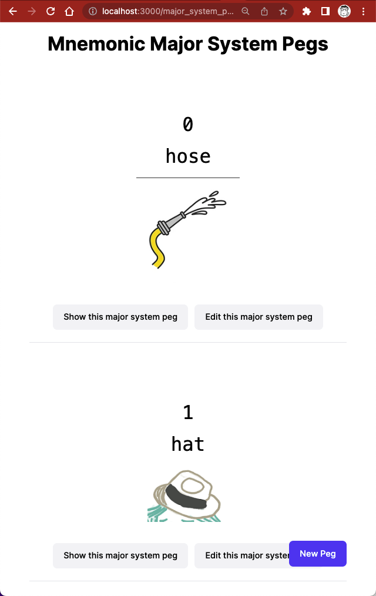

# A WIP app



## Notes for docker file

* postgresql
* brew install vips

## DB seed

To populate the DB with default images and major systems:

```shell
# locally
$ br db:seed
$ br db:seed:replant
# heroku
$ heroku run rake db:seed
$ heroku run rake db:seed:replant
```

`seeds.rb` contains more rules and instructions.

You might want to empty and clean up the AWS bucket at some point.
